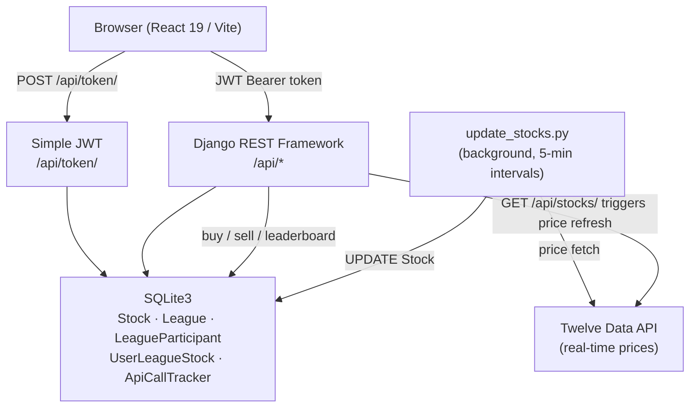

# Fantasy Stock League


---

## What It Is

**Fantasy Stock League** turns stock market investing into a competitive multiplayer game. Users join leagues of up to 8 players, each starting with a $10,000 virtual portfolio, and compete over 8-week seasons to build the highest-value holdings using real-time market data.

Think fantasy sports, but the lineup is your portfolio — every trade you make directly affects your standings against real opponents using live stock prices from the Twelve Data API.

---

## Key Features

- **Real-time price feeds** — Stock prices update every 5 minutes during NYSE market hours (9:30 AM – 4:00 PM EST) via the Twelve Data API, with a fixed 30-minute window tracked at the database level.
- **League lifecycle automation** — A league automatically sets its start and end date the moment the 8th participant joins, removing any manual setup burden.
- **Weighted average cost basis** — Buy/sell transactions update a per-user, per-league weighted average price per share, giving accurate profit/loss tracking across partial position changes.
- **Leaderboard rankings** — Standings are calculated in real time by summing each participant's cash balance and the current market value of their holdings.
- **Route-level authorization** — JWT-protected routes enforce both authentication (valid token) and league membership (user is a participant in the requested league).
- **API rate limiting** — An `ApiCallTracker` singleton enforces Twelve Data API quotas (5 calls per 30-minute fixed window) to prevent third-party throttling.

---

## Tech Stack

| Technology | Role | Why |
|---|---|---|
| **Django 5.2 + DRF** | REST API backend | Battle-tested ORM, built-in admin, DRF serializers keep request/response validation clean |
| **Simple JWT** | Authentication | Stateless JWT tokens eliminate server-side session storage; refresh token flow keeps sessions alive |
| **SQLite3** | Database (dev) | Zero-config for local development; migrations are written to be database-agnostic for a future PostgreSQL move |
| **Twelve Data API** | Live stock prices | Free tier covers development; structured JSON response maps directly onto the `Stock` model |
| **React 19 + Vite** | Frontend SPA | React 19's concurrent features pair with Vite's near-instant HMR for a fast dev loop |
| **React Router v7** | Client routing | Nested route guards (auth + league membership) are cleanly expressed as wrapper components |
| **CSS Modules** | Component styling | Scoped class names prevent global style bleed without the runtime overhead of CSS-in-JS |
| **WhiteNoise** | Static file serving | Serves React build artifacts from Django with correct cache headers — no extra CDN required in staging |

---

## Architecture Overview



**Request flow:**
1. The React SPA authenticates via JWT and attaches the token to every subsequent request.
2. The DRF backend validates the token, enforces league membership via route guards, and delegates to utility modules (`buySellStock.py`, `leagueUtils.py`, `joinLeague.py`).
3. A background script (`update_stocks.py`) polls Twelve Data every 5 minutes during market hours and writes updated prices to the database.
4. The `ApiCallTracker` singleton prevents exceeding the API quota regardless of how many concurrent requests arrive.

---

## Getting Started

### Prerequisites

- Python 3.13+
- Node.js 20+
- A free [Twelve Data API key](https://twelvedata.com/)

### 1 — Clone the repository

```bash
git clone https://github.com/MichaelAho1/FantasyStockLeague.git
cd FantasyStockLeague
```

### 2 — Backend setup

```bash
cd server

# Install Python dependencies
pip install django djangorestframework djangorestframework-simplejwt \
            django-cors-headers whitenoise python-dotenv pytz

# Create your environment file
cp .env.example .env        # then fill in STOCK_API_KEY

# Apply migrations
python manage.py migrate

# Populate initial stock tickers (AAPL, MSFT, GOOGL, AMZN, TSLA)
python populate_stocks.py

# Start the Django dev server
python manage.py runserver
```

### 3 — Frontend setup

```bash
cd ../client

npm install
npm run dev
```

The app is now running at **http://localhost:5173** (frontend) and **http://localhost:8000** (API).

### 4 — Start the stock price updater (optional for local dev)

```bash
cd server
python update_stocks.py
```

This process runs continuously during market hours and updates prices every 5 minutes.

### Environment variables

Create `server/.env` based on the template below:

```dotenv
# server/.env.example

# Twelve Data API key — https://twelvedata.com/
STOCK_API_KEY=your_twelve_data_api_key_here

# Django secret key — generate with: python -c "from django.core.management.utils import get_random_secret_key; print(get_random_secret_key())"
SECRET_KEY=your-django-secret-key-here

# Set to False in production
DEBUG=True
```

---

## API Reference

All endpoints (except token endpoints) require an `Authorization: Bearer <access_token>` header.

### Authentication

| Method | Path | Description |
|--------|------|-------------|
| `POST` | `/api/user/register/` | Register a new user |
| `POST` | `/api/token/` | Obtain JWT access + refresh tokens |
| `POST` | `/api/token/refresh/` | Refresh an expired access token |
| `PUT`  | `/api/user/update-username/` | Update the authenticated user's username |

**Register — example request**
```json
POST /api/user/register/
{ "username": "trader1", "password": "securepassword" }
```

### Stocks

| Method | Path | Description |
|--------|------|-------------|
| `GET`  | `/api/stocks/` | All tracked stocks with current prices |
| `GET`  | `/api/owned-stocks/<league_id>/` | Authenticated user's holdings in a league |
| `GET`  | `/api/stocks/info/<league_id>/<ticker>/` | Detailed stock info + user position |
| `POST` | `/api/stocks/buy/` | Buy shares of a stock |
| `POST` | `/api/stocks/sell/` | Sell shares of a stock |

**Buy shares — example request**
```json
POST /api/stocks/buy/
{ "league_id": "uuid-here", "ticker": "AAPL", "shares": 5 }
```

### Leagues

| Method | Path | Description |
|--------|------|-------------|
| `GET`  | `/api/leagues/` | All leagues the authenticated user belongs to |
| `POST` | `/api/leagues/` | Create a new league |
| `POST` | `/api/leagues/join/` | Join an existing league by ID |
| `GET`  | `/api/leagues/<league_id>/leaderboard/` | Ranked standings for a league |
| `PUT`  | `/api/leagues/<league_id>/set-start-date/` | Set league start date (admin only) |
| `DELETE` | `/api/leagues/<league_id>/delete/` | Delete a league (admin only) |

**Create league — example request**
```json
POST /api/leagues/
{ "name": "Tech Bulls 2025" }
```

**Leaderboard — example response**
```json
[
  { "username": "trader1", "portfolio_value": 11420.50, "rank": 1 },
  { "username": "trader2", "portfolio_value": 10835.00, "rank": 2 }
]
```

---

## Screenshots

### League Dashboard

<!-- Add screenshot: league leaderboard + owned stocks widget -->
> *Leaderboard showing ranked participants with portfolio values and owned stock tiles.*

### Stock Explorer

<!-- Add screenshot: stock list with search bar and trade modal open -->
> *Paginated stock table with real-time prices, search, and buy/sell modal.*

### Leagues Page

<!-- Add screenshot: leagues page with create/join forms -->
> *Create or join leagues; pending leagues show participant count progress toward the 8-player start threshold.*

---

## Contact

**Michael Aho**
- GitHub: [@MichaelAho1](https://github.com/MichaelAho1)

---

## License

This project is licensed under the MIT License.
